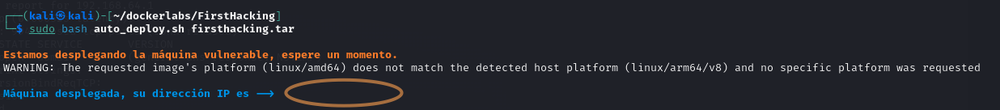
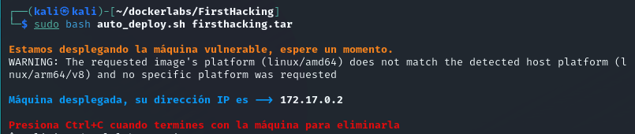
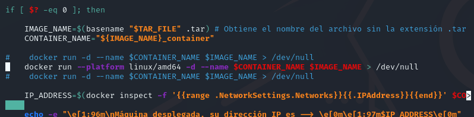
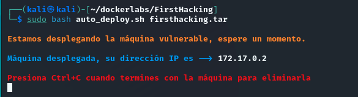

# dockerlabs.es
Aqui iré hackeando las diferentes máquinas que hay creadas en dockerlabs.es


## Información para usuarios de Mac con chip M1,M2,etc

Yo he querido ponerme a hackear máquinas después de unos meses de pausa de haberme sacado el Máster en Ciberseguridad y Privacidad. He optado por <a href="https://dockerlabs.es">dockerlabs.es</a> porque conocia de video tutoriales a Mario, su canal de Youtube (<a href="https://www.youtube.com/channel/UCGLfzfKRUsV6BzkrF1kJGsg"><b>El pingüino de Mario</b></a>) y su academia (por videos, no por que haya sido miembro, pero no descarto eso). En fin, que me lío.
Al querer empezar por el pirncipio y dedicarme a hackear las máquinas MUY FÁCILES, me di cuenta que al lanzar el script en Bash que (<b>elpinguinodemario</b>) tan amablemente nos ha perepadado, en mi caso <b><i>no</i></b> me devolvia al IP de la máquina en cuestion, con lo que comprendereis que se hace imposible realizar la fase de enumeración.

<p align="center">
  
</p>

>[!NOTE]
> Aquí aprovecho para aclarar que en mi caso concreto uso un Mac con chip M1 y el entorno virtual en el cual hago correr ```Kali Linux``` es en <a href="https://github.com/utmapp/UTM">UTM</a>, un emulador de sistema con todas las funciones y un host de máquina virtual para iOS y macOS. Está basado en QEMU, por si más adelante en el post os preguntais el porqué del comando lanzado en la terminal -> ```...qemu-user-static```.

Después de mucho investigar y preguntar en discord (quiero dar las gracias <b>condor777</b> aquí también por echarme un cable con esto) no acababa de dar con la tecla adecuada.
En algún foro de StackOverflow vi que se mencionaba el hecho de "forzar" la arquitectura correcta a la hora de llamar el contenedor, esto se haria con ```--platform linux/amd64```, pero tampoco resultó ser muy útil, ya que si que es cierto que en algún momento me daba la IP, esto no era un hecho consistente, y en otras pruebas volví a estar como al principio (la máquina docker no me daba la IP).

Rebuscando, y ahora pienso que deberia haber ido ahi directamente, en la web de ```docker.docs -> Manuals -> Multi-platform images``` se explica lo siguiente. Esta parte es una citación directa de la web de Docker.com:

```
QEMU without Docker Desktop
If you're running Docker Engine on Linux, without Docker Desktop, you must install statically compiled QEMU binaries and register them with binfmt_misc.
This enables QEMU to execute non-native file formats for emulation. The QEMU binaries must be statically compiled and registered with the fix_binary flag.
This requires a kernel version 4.8 or later, and binfmt-support version 2.1.7 or later.
```
Ok, todo esto está muy bien, pero cómo hago para poder hacer correr docker en mi Mac M1 (en una MV de Linux) y docker se piense que está corriendo en una arquitectura AMD64? Pues lo que no esté en GITHUB no exite en mi parecer 😄.
Solo teneis que seguir los paso detallados en éste repositorio de <a href="https://github.com/actions/runner-images/issues/2095">Github</a>.

Básicamente teneis que lanzar el siguiente comando en la terminal:

>[!TIP]
>Igual antes teneis que actualizar -> ```sudo apt-get update && sudo apt-get upgrade```

```linux
sudo apt install --assume-yes binfmt-support qemu-user-static
```

Una vez esté todo instalado, lanzais el script de Bash como se menciona en las instrucciones de ```dockerlabs.es```y deberias poder ver la IP:

<p align="center">
  
</p>

Para quitaros el warning lo único que teneis que hacer es adaptar el script en bash de la manera siguiente:

```bash
docker -run --platform linux/amd64 -d --name $CONTAINER_NAME $IMAGE_NAME > /dev/null
```

Os adjunto una imagen para que lo veais mejor:

<p align="center">
  
</p>

Como veis tengo comentadas algunas líneas, es por el testing que estuve haciendo.

<p align="center">
  
</p>

Y con esto ya no vereis más el warning y ya podeis empezar a hackear máquinas en ```dockerlabs.es``` !!<br>
Gracias!! 😎

>[!NOTE]
> Con esto solo quiero añadir que no me quiero llevar el crédito que no me corresponde, esta información ya estaba a disposición de todos en internet, solo he querido recopilar la informacion y resumir los pasos para ayudar a personas con el mismo problema. 😅 (Mac Apple Silicon ...)
